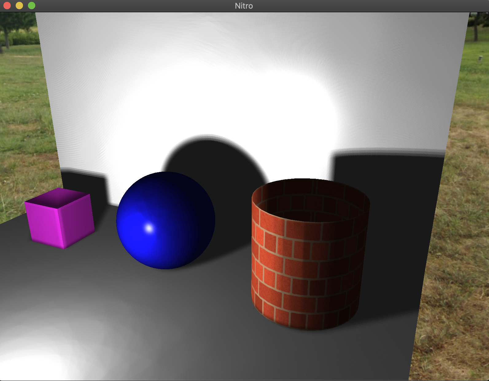
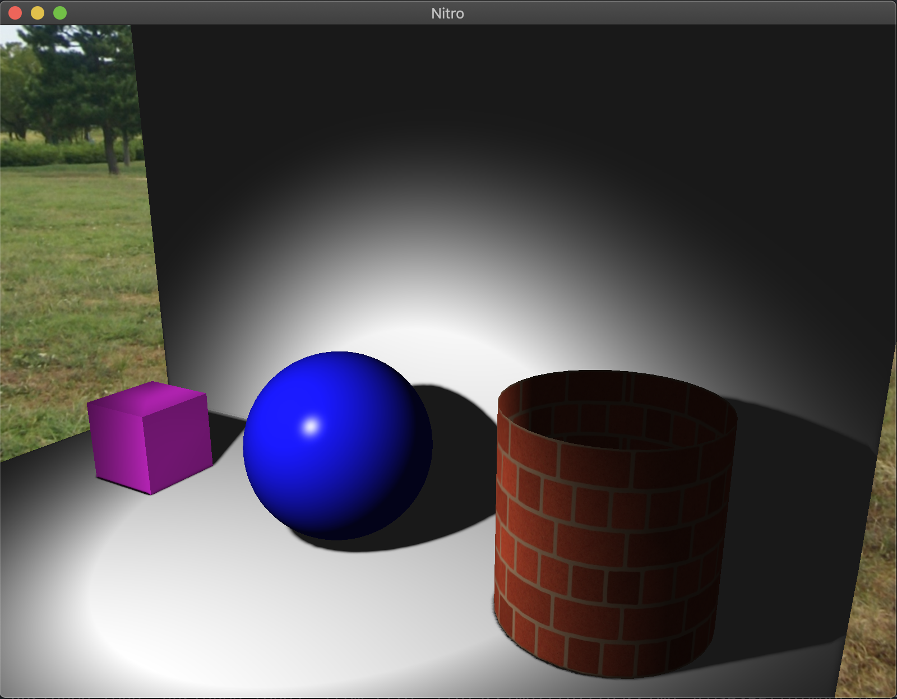
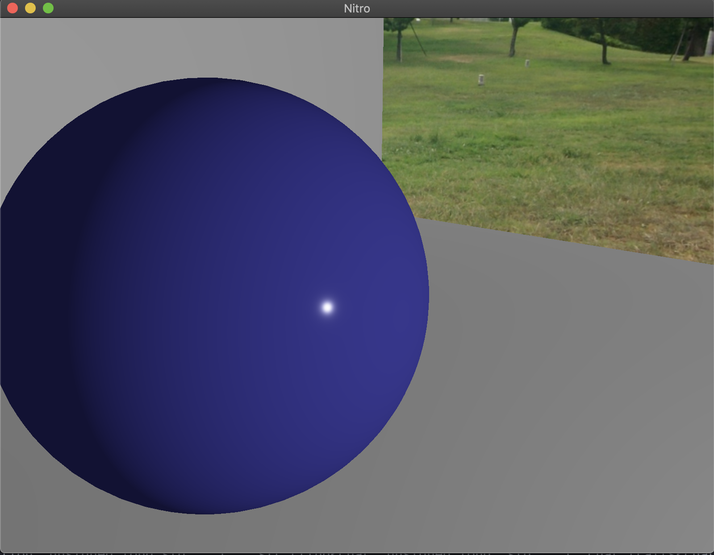

# Nitro
Nitro is a real-time 3D renderer built using C++ and OpenGL that aims to implement the latest rendering techniques such as: 
+ Physically Based Rendering (PBR).
+ Ambient Occlusion.
+ Parallax Occlusion Mapping.
+ Normal Maping.
+ Environment Mapping.
+ Dynamic Shadow Mapping.
+ Atmospheric Scattering. 
+ Bloom.
+ Volumetric lighting.
+ Deferred Rendering.
  
Also, another of the objectives of Nitro is to implement core aspects of a renderer from scratch (except model loading since we want to test the renderer with a number of models):
+ Virtual Camera: Movement and Rotation.
+ Light Sources:  Point Lights, Directional Lights and SpotLights.
+ Primitives:     Planes, Cubes and Spheres.
+ Event System.

## How to build:
Clone the project:
```bash
git clone https://github.com/rxwp5657/Nitro.git
```

Download and init project dependencies with the following command:
```bash
git submodule update --init --recursive  lib/
```

Create a build directory on the project root folder ../Nitro/build and change into that directory:
```bash
mkdir build && cd build
```

Type the following commands:
```bash
cmake ..
make && ./nitro
```

## How to use:
Move through the scene by using WASD and your mouse as you like and exit by pressing ESC on your keyboard (artifacts appearing becuase of GIF format):


## Progress:

### Point Light Shadow Mapping:


### Spot Light Shadow Mapping:


### Parallax Occlussion Mapping:
Without Parallax vs Parallax 


### Environment Mapping 

To be uploaded ...

## PBR pipeline implementation (Still in development)



## To-Do list:
+ Dynamic Variance Shadow Mapping:
  + Gaussian Blur (Spotlights).
  + Implement Percentage-Closer Soft Shadows.
  + Cascade Shadow Mapping.
+ PBR:
  + Add PBR materials to Material struct.
  + Add PBR materials to Model loader.
  + Implement BRDF algorithm on shaders (Cook–Torrance? or Lambert or Brent Burley (Disney)).
+ Implement Deferred Rendering:
  + Implement G-buffer structure.
  + Implement G-buffer components (Diffuse, Normla, Depht, etc.).
  + Implement Light Volume.
+ Study and Implement Atmospheric Scattering.
+ Study and Implement Ambient Occlusion.
+ Study and Implement Bloom.
+ Study and Implement Volumetric Lighting.
+ Study and Implement Image-Based Lighting.
